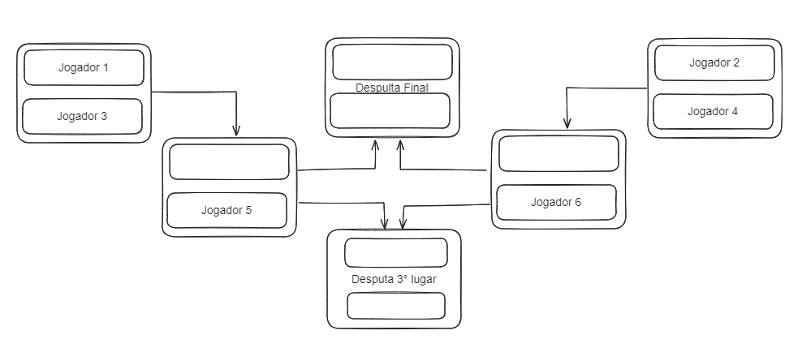

# Single Elimination Tournament


## Sobre o projeto
O projeto tem como ideia disponibilizar uma API para criação de torneios elinatórios, também conhecido como mata-mata.

A forma que cria o torneio traz equilibrio entre as chaves, ou seja, irá distribuir o mais igualmente possível entre os lados da chave.

Um exemmplo: caso sejá informado 6 participantes, teremos o seguinte chaveamento:



## Iniciando o projeto
O projeto foi contruído com Docker, então só será necessário subir o container:

```
docker-compose up
```

Após isso, já poderá acessar [localhost:80](https://localhost:80)

Caso opite por iniciar manualmente, é necessário seguintes os seguintes pontos:

- Necessário ter o `python` em sua maquina, de preferencia na versão `3.10.12`
- Possuir `PostgreSQL` instalado, de preferencia na versão `16.1`
- Atualizar os arquivos [envs/](/envs) de acordo com sua conexão ao postgres

Com essa configuração, poderá rodar os seguinters scripts:

```shell
# Para instalação das libs necessárias
pip install --no-cache-dir --upgrade -r requirements.txt

# Para atualização do banco de dados
alembic upgrade head

# iniciar o projeto
uvicorn app.main:app --reload --env-file envs/default.env --host 0.0.0.0 --port 80
```

Com isso, já podera acessar o [localhost:80](https://localhost:80)

## Rodando os testes
Caso tenha opitado por uso do docker, com o container rodando, execute:
```shell
docker compose exec -it app pytest -v
```

Se opitou por executar sem o Docker:
```shell
pytest -v
```

## Documentação do sistema

Ao rodar o projeto, terá a disposição da documentação já gerada pelo FastAPI: 
- [docs](https://localhost:80/docs)
- [redocs](http://localhost:80/redoc)


## Tecnologias utilizadas

Projeto em python utilizando as libs:
- [FastAPI](https://fastapi.tiangolo.com/) como framework API
- [SQLAlchemy](https://docs.sqlalchemy.org/en/20/) como ORM
- [Alembic](https://alembic.sqlalchemy.org/en/latest/) como controlador de migração
- [Pytest](https://docs.pytest.org/en/8.0.x/) como auxiliar para realizações dos testes

Além das ferramentas:
- [Docker](https://www.docker.com/)
- [Postgresql](https://www.postgresql.org/) como Banco de Dados
- [github workflow](https://docs.github.com/en/actions/using-workflows/about-workflows) como CI

## Possíveis melhorias

Em questão de infraestrutura:
- A organização foi voltada pensando em _Clean Architecture_, porém foi utilizado só a base da ideia, precisando revisar ele.

Questão de uso:
- Adicionar um mini projeto front para melhorar a visualização do que acontece
- Revisar a documentação para trazer melhores os exemplos, principalmente em erros
- Revisar para ver comportamentos de erros internos (500)
- Adicionar testes em rotas que lidam com os comporamentos de erros internos (500)
 
